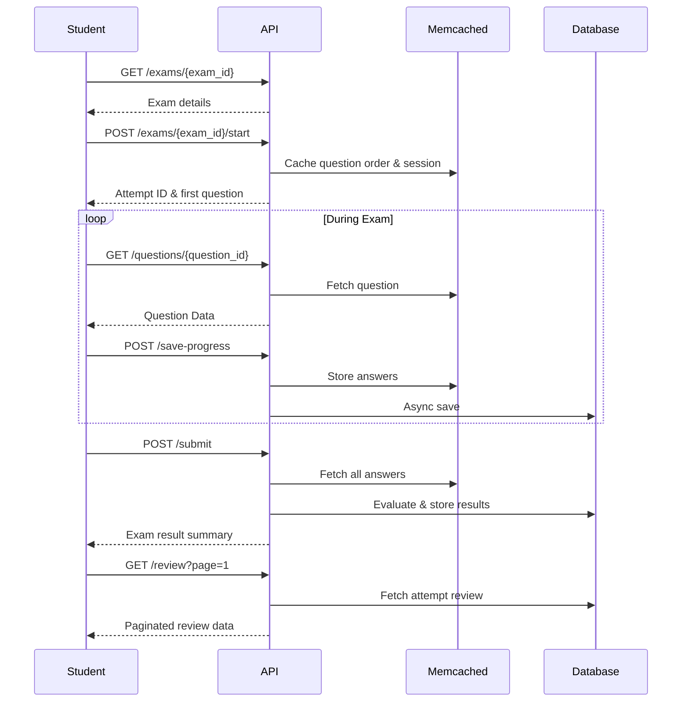

# 🧠 Exam Module API Documentation

This document describes the **Exam Module APIs** for student-side integration in the LMS system.  
These APIs manage exam access, question retrieval, progress saving, submission, results, and review.

---

## ⚙️ Response Format Standard

All API responses follow the **global Trogon LMS format**:

```json
{
  "status": true,
  "http_code": 200,
  "message": "Message text",
  "data": [],
  "errors": {},
  "meta": {}
}
```

---

## 📘 1. Get Exam Details

**Endpoint**
```
GET /api/v1/exams/{exam_id}
```

**Purpose**
Fetch general details about the exam before starting.

**Response Example**
```json
{
  "status": true,
  "http_code": 200,
  "message": "Exam details fetched successfully",
  "data": {
    "id": 101,
    "title": "Physics Final Exam",
    "description": "Covers Mechanics, Thermodynamics, and Optics",
    "time_limit": 90,
    "total_questions": 300,
    "attempts_allowed": 2,
    "attempts_used": 1
  },
  "errors": {},
  "meta": {}
}
```

---

## ▶️ 2. Start Exam Attempt

**Endpoint**
```
POST /api/v1/exams/{exam_id}/start
```

**Purpose**
Creates a new attempt and initializes question order + cache for the student.

**Response Example**
```json
{
  "status": true,
  "http_code": 200,
  "message": "Exam started successfully",
  "data": {
    "attempt_id": 5123,
    "total_questions": 300,
    "time_limit": 90,
    "first_question_id": 231,
    "question_order": [231, 245, 250, 255, 270, 301],
    "started_at": "2025-10-08T09:00:00Z"
  },
  "errors": {},
  "meta": {}
}
```

---

## ❓ 3. Fetch Question (On-Demand)

**Endpoint**
```
GET /api/v1/exams/{exam_id}/attempts/{attempt_id}/questions/{question_id}
```

**Purpose**
Fetch a specific question when the user navigates to it.  
Supports **random jumps** (e.g., Question 1 → Question 100 → Question 30).

**Response Example**
```json
{
  "status": true,
  "http_code": 200,
  "message": "Question fetched successfully",
  "data": {
    "question_id": 231,
    "question_number": 1,
    "question_text": "What is Newton's Second Law?",
    "question_type": "mcq_single",
    "marks": 1,
    "options": [
      { "id": 1, "text": "F = ma" },
      { "id": 2, "text": "E = mc²" },
      { "id": 3, "text": "V = IR" }
    ],
    "student_answer": {
      "selected_option_ids": [1]
    },
    "is_flagged": false
  },
  "errors": {},
  "meta": {}
}
```

---

## 💾 4. Save Progress (Auto / Manual)

**Endpoint**
```
POST /api/v1/exams/{exam_id}/attempts/{attempt_id}/save-progress
```

**Purpose**
Periodically save current answers during exam.  
This ensures progress is stored in cache (Memcached) and synced with DB asynchronously.

**Request Example**
```json
{
  "attempt_id": 5123,
  "answers": [
    {
      "question_id": 231,
      "selected_option_ids": [1],
      "time_spent": 15
    },
    {
      "question_id": 245,
      "answer_text": "Force equals mass times acceleration",
      "time_spent": 10
    }
  ]
}
```

**Response Example**
```json
{
  "status": true,
  "http_code": 200,
  "message": "Progress saved successfully",
  "data": {},
  "errors": {},
  "meta": {}
}
```

🧠 **Notes**
- Data first stored in **Memcached** → asynchronously synced to DB.  
- Auto-save every 1–2 minutes or on navigation change.  
- On resume, progress is restored from cache or DB.

---

## 📤 5. Submit Exam

**Endpoint**
```
POST /api/v1/exams/{exam_id}/attempts/{attempt_id}/submit
```

**Purpose**
Finalize the exam attempt.  
Evaluates all answers, stores results in DB, and clears cached data.

**Request Example**
```json
{
  "attempt_id": 5123,
  "auto_submit": false
}
```

**Response Example**
```json
{
  "status": true,
  "http_code": 200,
  "message": "Exam submitted successfully",
  "data": {
    "score": 82,
    "correct_count": 41,
    "wrong_count": 9,
    "status": "passed",
    "submitted_at": "2025-10-08T09:35:00Z"
  },
  "errors": {},
  "meta": {}
}
```

🧠 **Notes**
- Automatically triggered if time expires.
- Clears Memcached data for the attempt after evaluation.

---

## 🗾️ 6. Get Exam Result Summary

**Endpoint**
```
GET /api/v1/exams/{exam_id}/attempts/{attempt_id}/result
```

**Purpose**
Retrieve overall result summary after submission.

**Response Example**
```json
{
  "status": true,
  "http_code": 200,
  "message": "Exam result fetched successfully",
  "data": {
    "attempt_id": 5123,
    "score": 82,
    "max_score": 100,
    "pass_score": 40,
    "correct_count": 41,
    "wrong_count": 9,
    "skipped_count": 5,
    "status": "passed",
    "submitted_at": "2025-10-08T09:35:00Z"
  },
  "errors": {},
  "meta": {}
}
```

---

## 🔍 7. Review Attempt (Paginated)

**Endpoint**
```
GET /api/v1/exams/{exam_id}/attempts/{attempt_id}/review?page=1&per_page=20
```

**Purpose**
View the full review with questions, student answers, correct answers, and explanations.

**Response Example**
```json
{
  "status": true,
  "http_code": 200,
  "message": "Exam review fetched successfully",
  "data": {
    "exam": {
      "id": 101,
      "title": "Physics Final Exam"
    },
    "attempt": {
      "id": 5123,
      "score": 82,
      "status": "passed"
    },
    "questions": [
      {
        "id": 231,
        "question_number": 1,
        "question_text": "What is Newton's Second Law?",
        "question_type": "mcq_single",
        "marks": 1,
        "student_answer": {
          "selected_option_ids": [1]
        },
        "correct_answer": {
          "selected_option_ids": [1]
        },
        "is_correct": true,
        "explanation": "Force equals mass times acceleration.",
        "options": [
          { "id": 1, "text": "F = ma", "is_correct": true },
          { "id": 2, "text": "E = mc²", "is_correct": false }
        ]
      }
    ]
  },
  "errors": {},
  "meta": {
    "current_page": 1,
    "last_page": 15,
    "per_page": 20,
    "total": 300,
    "from": 1,
    "to": 20
  }
}
```

🧠 **Notes**
- Supports pagination for large exams.  
- Use query params `?page=` and `?per_page=`.  
- Keeps exam and attempt summary consistent across pages.  
- `meta` block follows the **same pagination structure** as your Feeds API.

---

## 🧠 Integration Notes

| Area | Description |
|------|--------------|
| **Caching Layer** | Questions & answers are cached in **Memcached** (`exam_attempt:{id}:answers`) to improve performance. |
| **DB Sync** | A background job or queue periodically syncs cached progress to the `exam_answers` table. |
| **Fail-safe Recovery** | On cache loss, backend restores progress from DB seamlessly. |
| **Time Tracking** | Use server time (`started_at` + `time_limit`) to prevent cheating. |
| **Auto Submit** | When the timer ends, frontend or backend triggers `/submit`. |
| **Review Control** | Review visibility depends on `exam.review_mode` (none, summary, full). |

---

## 🚨 Error Response Example

```json
{
  "status": false,
  "http_code": 404,
  "message": "Exam attempt not found",
  "data": {},
  "errors": {
    "attempt": "No active attempt found for this user"
  },
  "meta": {}
}
```

---

## ✅ Summary of Student APIs

| # | API | Method | Description |
|---|------|---------|-------------|
| 1 | `/api/v1/exams/{exam_id}` | GET | Fetch exam info |
| 2 | `/api/v1/exams/{exam_id}/start` | POST | Start new attempt |
| 3 | `/api/v1/exams/{exam_id}/attempts/{attempt_id}/questions/{question_id}` | GET | Fetch one question |
| 4 | `/api/v1/exams/{exam_id}/attempts/{attempt_id}/save-progress` | POST | Save answers periodically |
| 5 | `/api/v1/exams/{exam_id}/attempts/{attempt_id}/submit` | POST | Submit exam and evaluate |
| 6 | `/api/v1/exams/{exam_id}/attempts/{attempt_id}/result` | GET | Fetch result summary |
| 7 | `/api/v1/exams/{exam_id}/attempts/{attempt_id}/review` | GET | Paginated review of attempt |

---

## 📊 API Flow Diagram



---

**Last Updated:** October 2025  
**Maintained By:** Trogon LMS Development Team